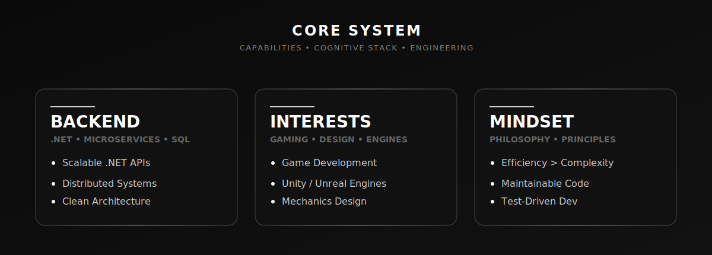
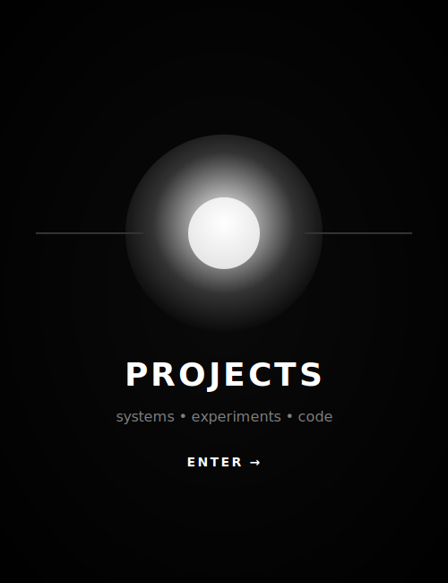
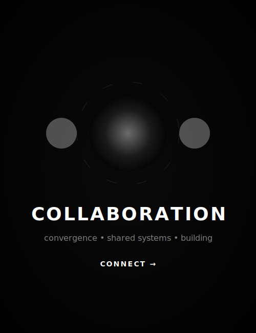

  

<!-- Title -->
<h3 align="center">
    <samp>
        &gt; Hello!, I'm
        <b><a target="_blank" href="https://www.linkedin.com/in/jeison-cristancho-garcia-06a48b35b/">Jeison Cristancho</a></b>
    </samp>
</h3>

 

<samp>
Junior Backend Developer in .NET, focused on creating scalable and maintainable solutions.  
</samp>

  

<!-- Title -->

  

  

# 🛠 Technologies and Projects

<table border="0" cellspacing="10" cellpadding="0">
<tr>

<!-- LEFT: TOOLS -->
<td width="420" valign="top" align="center">

<h3>🛠 Technologies</h3>
 

<table align="center" cellspacing="0" cellpadding="6">
  <tr>
    <td align="center"></td>
    <td align="center"></td>
    <td align="center"></td>
    <td align="center"></td>
    <td align="center"></td>
    <td align="center"></td>
  </tr>
  <tr>
    <td align="center"></td>
    <td align="center"></td>
    <td align="center"></td>
    <td align="center"></td>
    <td align="center"></td>
    <td align="center"></td>
  </tr>
  <tr>
    <td align="center" colspan="6"></td>
  </tr>
</table>

</td>

<!-- PROJECTS -->
<td width="260" valign="top" align="center">

<h3>🧪 Projects</h3>
 

  
  

    <samp>
      • LuxTime 
      • Hotel Carmen 
      • Tournament Mgr 
      • Real Estate Sys 
      • Flight Ticket Mgmt
    </samp>
  

</td>

</tr>
</table>

### 📊 Vital Statistics

  

  

    

  

<table width="100%" border="0" cellspacing="10" cellpadding="0">
<tr>

<!-- LEFT: COLLAB -->
<td width="33%" valign="top">

<h2>🤝 Collaboration</h2>

I’m open to collaborating on:

<ul>
  <li>Backend development with .NET</li>
  <li>Microservices & Scalable Systems</li>
  <li>API Design & Optimization</li>
  <li>Database Management (SQL/NoSQL)</li>
</ul>

</td>

<!-- MIDDLE: PANEL -->
<td width="34%" align="center" valign="middle">
    
</td>

<!-- RIGHT: CONTACT -->
<td width="33%" valign="top" align="center">

<h2>📫 Contact</h2>

 

  

  

</td>

</tr>
</table>

⚡ Building scalable backend systems and maintainable .NET solutions

 ⭐ if you Like it!!

